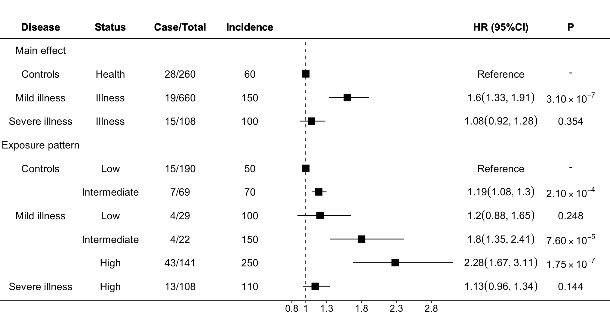

# myepi：高效、灵活的流行病学回归与可视化工具包

**myepi** 是一个面向流行病学研究的数据分析辅助工具包，旨在简化队列研究中的回归建模与结果展示流程。该包集成了模型拟合与结果可视化的常用功能，特别适用于 Cox 比例风险模型分析与分组亚组研究。

## Installation
```R
# 若希望直接更新该R包，则在未加载 myepi 的基础上直接运行下方代码即可
devtools::install_github("yuanlinm/myepi")
library(myepi)
```

## Contents
- [Introduction](#introduction)
- [Method](#method)
- [Results](#results)
- [Conclusion](#conclusion)


## 核心功能

### 1. `cox_run()`：一行代码完成 Cox 模型拟合与亚组分析

- **模型构建**：自动识别变量类型，支持连续变量与分类变量建模。
- **多模型一体输出**：支持多组模型并行运行，输出统一格式的结果表，便于整理与后续绘图。
- **稳健性检查**：提供默认的模型错误检测与提示，防止变量缺失或格式错误导致的失败。

**示例用法**：

```r
myepi::cox_run(
  data = data, time = 'LC_inci_difftime', event = 'LC_incidence',
  riskvar = 'age', covars =  c("age","sex"), groupvar = 'sex', ref = NULL
)
```

**结果示例**
| group   | level | g_levels | case_total | incidence | hr   | hr_lower | hr_upper | beta | se   | p     |
|---------|-------|----------|-------------|-----------|------|----------|----------|------|------|-------|
| pm2.5   | All   | All      | 123/1000    | 245.78    | 1.75 | 1.30     | 2.35     | 0.56 | 0.15 | 0.001 |

or

| group   | level | g_levels | case_total | incidence | hr   | hr_lower | hr_upper | beta | se   | p     |
|---------|-------|----------|-------------|-----------|------|----------|----------|------|------|-------|
| smoke   | No    | All      | 80/1500     | 125.60    | 1.00 | 1      | 1      | 0  | 0  | 1   |
| smoke   | Yes   | All      | 123/1000    | 245.78    | 1.75 | 1.30     | 2.35     | 0.56 | 0.15 | 0.001 |

or

|group |level     |g_levels |case_total | incidence|     hr| hr_lower| hr_upper|   beta|     se|         p|
|:-----|:---------|:--------|:----------|---------:|------:|--------:|--------:|------:|------:|---------:|
|urban |good      |rural    |411/5377  |     62.76| 1.1676|   0.9493|   1.4361| 0.1549| 0.1056| 0.1423593|
|urban |poor      |rural    |171/2005  |     74.04| 1.2611|   0.9899|   1.6065| 0.2320| 0.1235| 0.0603900|
|urban |good      |urban    |398/3383  |     99.44| 1.2648|   1.0797|   1.4817| 0.2349| 0.0807| 0.0036124|
|urban |poor      |urban    |218/1364 |    139.69| 1.4647|   1.2140|   1.7671| 0.3817| 0.0958| 0.0000674|


---


### 2. `forestplot()`: 高质量、灵活可调的森林图绘制工具

- **多列信息展示**：支持左右两侧添加任意自定义列（如变量名称、HR值、95%CI、P值等）。
- **全参数可调节**：图形的颜色、大小、字体、间距、置信区间线型等均可自定义，满足审稿图或演示图的精细化需求。
- **支持科学记数法P值**：内置科学计数法格式化方案，适配流行病学常见的极小P值展示。
- **与 cox_run() 无缝衔接**：可直接使用 cox_run() 的结果表进行绘图，一键生成高质量出版级别森林图。

**示例用法**：
```r
myepi::forestplot(df = df,left_side_cols = c(1:4),
      right_side_cols = c(11:12),
      estimate = 'HR',
      lower = 'HR_lower',
      upper = 'HR_upper',
      p_value_col = 'P'
)
```
**结果示例**


---


### 3. `getnas()`: 高质量、灵活可调的森林图绘制工具

- **功能**：快速按变量、类型和缺失率报告缺失值，并按缺失百分比排序。非常适合数据清理。

**示例用法**：
```r
myepi::getnas(dat = data)
```

**结果示例**

|Variable                  |Type        | Missing|MissingRate |
|:-------------------------|:-----------|-------:|:-----------|
|cancer_base_site          |Categorical |  315828|100%        |
|aspirin                   |Categorical |  275700|87.29%      |
|family_cancer             |Categorical |   12985|4.11%       |
|siblings_can              |Categorical |    9854|3.12%       |
|cough_sputum              |Categorical |    6702|2.12%       |
|children_can              |Categorical |    4929|1.56%       |


