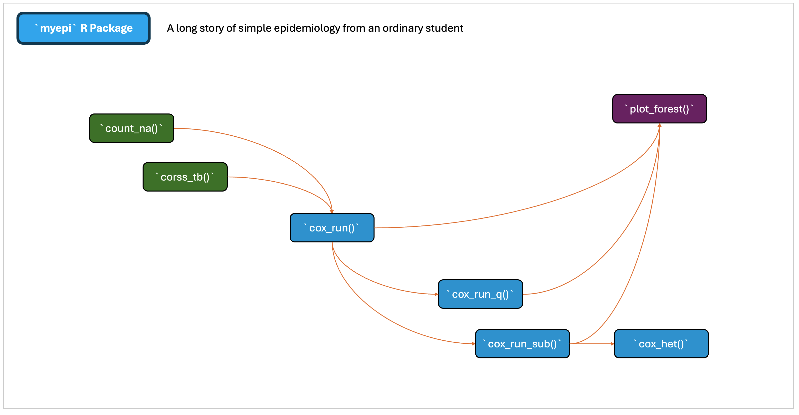

# myepi: 队列研究与生存分析快速工作流工具包

`myepi` 聚焦流行病学/临床队列常规分析：缺失概览、描述统计、Cox 主效应/分位数分组、亚组与异质性评估、以及可直接用于汇报与 PPT 的森林图。

> 反馈 / 需求 / 合作：欢迎关注公众号 **epi solution** 后直接发送留言。

---

## 安装与加载

```r
# 首次安装或更新
if (!requireNamespace("devtools", quietly = TRUE)) install.packages("devtools")
devtools::install_github("yuanlinm/myepi")
library(myepi)
```

## 功能函数总览

| 函数 | 作用简介 |
|------|----------|
| `count_na` | 缺失值扫描（可选分组） |
| `cross_tb` | 目标变量 × 分组变量的交叉统计（分类=频数比例，连续=均值+中位数） |
| `cox_run` | 核心 Cox 回归（支持 time1/time2 或 timediff；自动补参考水平行与发病率） |
| `cox_run_sub` | 按分组变量循环调用 `cox_run` 的亚组分析（可格式化为绘图友好形状） |
| `cox_run_q` | 连续变量按分位数或自定义断点分组 + 可选趋势性检验 |
| `cox_het` | 基于亚组结果 (beta/se) 的异质性检验 (Q, I2等) |
| `plot_forest` | 自定义文本布局 + 线性或对数轴森林图 + 可自动生成 “HR (L-U)” 组合列 |



---

## 快速上手

```r
# 1. 缺失扫描
count_na(dat = df)

# 2. 描述统计（例如性别按年龄组）
cross_tb(dat = df, var = "sex", by = c("age_group"))

# 3. 主效应 Cox
m_main <- cox_run(df, time1 = "time_start", time1 = "time_end", event = "status", mainvar = "exposure", covars = c("age","sex"))
head(m_main$result)

# 4. 连续变量按四分位 + 趋势检验
q_res <- cox_run_q(df, mainvar = "BMI", q = 4, timediff = "time", event = "status", covars = c("age","sex"), trend = TRUE)
attr(q_res, "quantile_breaks")   # 断点始终可取（即使结果为空）

# 5. 亚组分析（按 sex 分）
sub_res <- cox_run_sub(df, group_var = "sex", timediff = "time", event = "status", mainvar = "exposure", covars = c("age","BMI"))

# 6. 异质性检验
cox_het(sub_res)

# 7. 准备森林图（假设我们将亚组结果做了适当筛选/排序）
forest_plot <- plot_forest(
  df = sub_res,
  left_side_cols  = c(2, 3),          # 例如 Subgroup, Case_Total
  right_side_cols = c(6:9),          # 例如 HR, P （列号仅示意）
  estimate = "HR", lower = "HR_lower", upper = "HR_upper",
  add_est_ci = TRUE,                  # 自动生成 HR (L-U)
  x_log = TRUE,                       # 对数刻度（更适合 HR）
  x_limit = c(0.5, 3.0)
)
forest_plot
```

---

## 使用场景与结果输出流转Tips

### 1. 连续变量探索
用 `cox_run_q` 将连续指标（如 BMI）按 3–5 组等频或临床分界点切分，观察各区间 HR，并利用 `trend = TRUE` 输出趋势性指标（第一行 `beta_trend` / `P_trend`）。

### 2. 快速生成汇报森林图
使用 `cox_run_sub(plot_shape = TRUE)`或手工整理的绘图数据表 → `plot_forest`。
### 3. 亚组一致性与异质性
`cox_run_sub` 分析各亚组主效应 → `cox_het` 无缝对接完成对亚组间的异质性检验。

### 4. 自动/自定义断点策略
`cox_run_q(q = 3)`快速完成四分位数分析 ，`cox_run_q(q = c(10, 18.5, 24, 28, 40))` 直接反映临床或指南节点；结果属性中保留断点便于图形注释。

---

## 函数要点速查

> 所有功能函数的参数解释均使用中文撰写，载入myepi包之后可以方便地查看函数的所有参数细节。

### count_na: 缺失报告
简洁缺失分布；指定 `group_var` 可对关键分层（如中心 / 队列来源）做 QA 检查。

### cross_tb: 交叉/频率表
连续变量：均值+中位数；分类变量：长表输出频数+比例，支持 ≥1 分组变量。

### cox_run: Cox模型
支持 `time1,time2,event` 或 `timediff,event`；自动识别 `cluster()` 启用稳健标准误；自动识别`strata()`赋予差异基线风险；自动识别`*/+ term`处理相乘交互项；为分类主变量添加报告参考水平行并计算各水平的十万人年发病率等制表参数。

### cox_run_q: 分位数分析
整数 q → 等频分位；数值向量 → 自定义断点（严格递增）；趋势检验可选“组内中位数（`median`）”或“序号`ordinal`”得分；始终携带 `quantile_breaks` 属性。

### cox_run_sub: 亚组分析
按分组水平循环调用 `cox_run`；产出包含 Subgroup、病例 / 总数、发病率、HR 及区间；可进一步转为绘图表格(`plot_shape`)。

### cox_het: 组间异质性检验
对 Subgroup = “亚组名: 水平” 格式的结果拆分聚合，调用 `metafor::rma`；仅 ≥2 水平才计算。

### plot_forest: 森林图绘制
森林图左右文本列任意组合（通过列号指定）；线性或对数刻度（`x_log`）；可自动生成置信区间 “估计值 (下限-上限)” 列；P 值智能格式化（小值科学计数法）。

---

## 返回结果与常见字段说明
| 字段 | 含义 |
|-------|------|
| Case_Total | 事件数/总人数（或该水平样本） |
| Incidence | 发病率（每 100000 人年） |
| Interval | 连续变量区间或分类水平标签 |
| HR, HR_lower, HR_upper | 危险比及 95% CI |
| P | 双侧检验 P 值 |
| beta, se | log(HR) 及其标准误 |
| beta_trend, P_trend | 分位趋势检验结果（仅 `cox_run_q` ） |

---

## 常见问题 (FAQ)
**Q: 为什么 `cox_run_q` 有时返回空数据框但仍有断点属性?**  
A: 当无法形成有效非参考组（例如数据全 NA）时仍保留 `quantile_breaks`，方便你记录切分方案。

**Q: 森林图的列为什么用列号而不是列名?**  
A: 便于快速试错与灵活重排；如果更偏好列名，可在外层写一个包装函数映射。

**Q: P 值格式能否直接用于计算?**  
A: 图形中展示的为格式化字符串，如需进一步计算，请使用源结果表中原始数值列（不要对格式化列再解析）。

---

## 设计理念
少即是多：保持“90% 需求一步到位 + 10% 可直接在返回表/代码层二次加工”。


---

## 引用
如在研究或报告中使用本包，可在方法部分简单描述：
“Statistical analyses were performed in R using the myepi package (GitHub: yuanlinm/myepi) for missing data profiling, Cox regression, subgroup and heterogeneity analyses, and forest plot visualization.”
